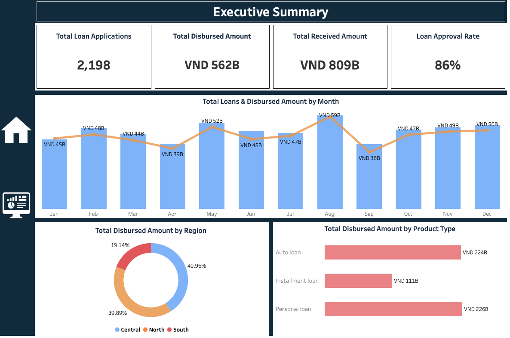
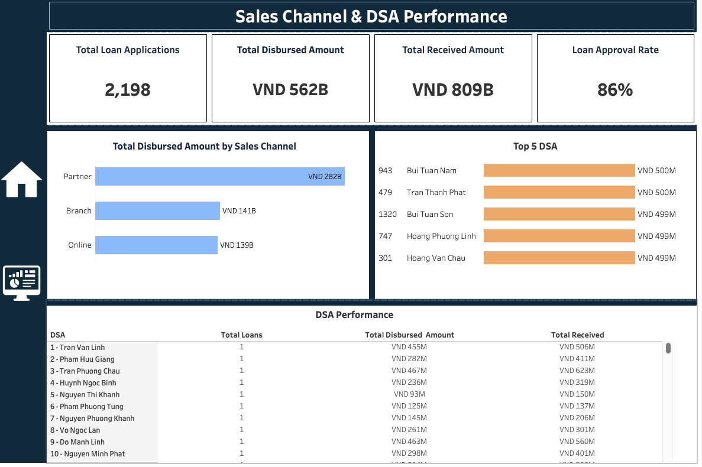

# 📊 Loan Sales & DSA Performance Report | 2023 

This project is a simulated version of a real-world reporting project originally developed for Shinhan Finance. All data has been modified and anonymized to protect business confidentiality. The structure, analysis logic, and reporting approach reflect realistic practices in the financial industry.

This project provides a comprehensive analysis of loan disbursement performance by Sales Channel and DSA (Direct Sales Agents) for a financial institution. The process includes data cleaning and performance analysis using SQL, followed by the development of interactive Tableau dashboards to monitor loan sales, channel contribution, and DSA performance.

---

## 💼 Project Overview

The dashboards were designed to help management, sales teams, and data analysts track:

- Total loan applications, disbursed amount, received amount, loan approval rate 
- Loan trends by month  
- Performance contribution by region and product type  
- Sales channel effectiveness  
- DSA performance and top performers  

These dashboards support data-driven decision-making to optimize loan sales activities.

---

## 📁 Dashboards Included

### 1. Executive Summary Dashboard

- Total Loan Applications  
- Total Disbursed Amount  
- Total Received Amount  
- Loan Approval Rate  
- Monthly Loan Disbursement Trend  
- Total Disbursed Amount by Region  
- Total Disbursed Amount by Product Type  

### 2.Sales Channel & DSA Performance Dashboard

- Total Disbursed Amount by Sales Channel  
- Top 5 DSA by Total Disbursed Amount  
- Full DSA Performance Table  

---
## 📊 Tableau Dashboard Pages
[🔗 View Full Tableau Dashboard on Tableau Public](https://public.tableau.com/views/LoanDashboard_YourName/ExecutiveSummary)

1. **Executive Summary**:

2. **Sales Channel & DSA Performance**:

## Key Highlights 

- Total loan applications: **2,198**  
- Total disbursed amount: **282B VND**  
- The **Partner** channel contributed the most, accounting for **50%** of the total disbursed amount  
- The **Top 5 DSAs** achieved a total disbursement of **2.5B VND**, representing **60%** of the overall disbursement
- The Central region achieved the highest disbursement among all regions, contributing **41%** of total disbursed amount
- Certain DSAs and sales channels show underperformance and may require additional support  
  
## 📊 Business Insights & Recommendations

- **Sales Channel Optimization:**  
  The Partner channel generates the largest loan disbursement. Consider expanding resources and support for this channel. Explore ways to improve performance in Branch and Online channels.

- **DSA Performance Focus:**  
  A small group of top DSAs contributes significantly to total disbursed amount. Develop incentive programs and training to replicate success across the DSA team.

- **Regional Opportunities:**  
  The Central region shows strong performance. Additional marketing or tailored products in this region could drive further growth.

- **Product Mix Analysis:**  
  Auto Loans dominate disbursed amount. Consider strategies to promote other product types to diversify the portfolio.

---

## ⚙️ Tools & Technologies

- Tableau (for data visualization)
- SQL (for data cleaning & analytics)  
- Excel/CSV files as a data source  

---
## 📧 Contact

Created by Ngan Huynh  
📬 Email: krishuynh2222@email.com  

